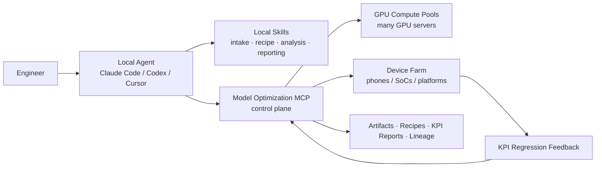
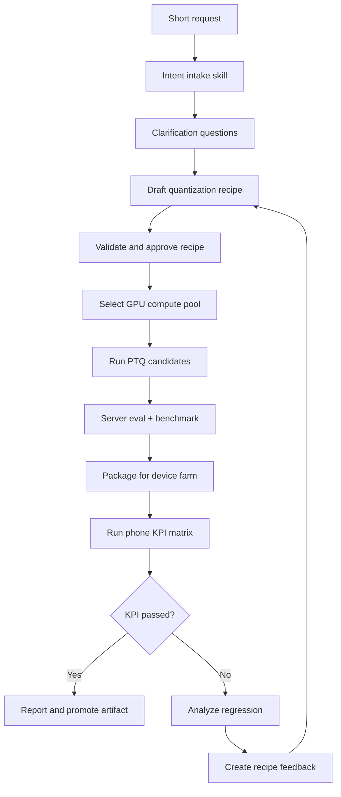

<p align="center">
  
</p>

<h1 align="center">Model Optimization MCP</h1>

<p align="center">
  <b>Hybrid Skill + MCP control plane for model quantization, GPU execution, device-farm KPI validation, and recipe feedback loops.</b>
</p>

<p align="center">
  <a href="README.zh-CN.md">中文 README</a>
  ·
  <a href="docs/enterprise-blueprint.md">Enterprise Blueprint</a>
  ·
  <a href="docs/mediatek-neuropilot-comparable-design.md">MediaTek Research</a>
  ·
  <a href="docs/architecture.md">Architecture</a>
  ·
  <a href="docs/tool-reference.md">Tool Reference</a>
  ·
  <a href="docs/agent-skill-pack.md">Agent Skills</a>
</p>

<p align="center">
  
  
  
  
</p>

## What This Is

Model Optimization MCP is a reference implementation of an enterprise model-optimization platform where engineers can talk to local agents such as Claude Code, Codex, or Cursor:

```text
"Use PTQ to quantize the Qwen3.6 model for Android devices."
```

The local agent does not need to be your own custom agent. It can use local skills for reasoning-heavy steps and call this MCP server for shared state, resource governance, remote execution, device-farm validation, and auditability.



## Why Hybrid Skill + MCP

Not every step should be an MCP tool.

Local skills are better for:

- turning vague human requests into structured requirements,
- asking necessary clarification questions,
- drafting and explaining recipes,
- reasoning about failures and bad cases,
- writing final human-facing summaries.

MCP tools are better for:

- shared server-side state,
- GPU resource leases and queueing,
- multi-node compute-pool scheduling,
- artifact and recipe lineage,
- device-farm test submission,
- KPI reports and feedback loops,
- auditable approvals and promotions.

This repo models that split explicitly. A workflow step can be executed by `local_skill`, `mcp_tool`, `human_approval`, `hybrid`, or `external_system`.

## End-to-End Loop



## Capabilities

- Requirement intake: convert vague requests into structured sessions and necessary questions.
- Recipe lifecycle: draft, validate, approve, revise, and list auditable quantization recipes.
- Hybrid planning: generate workflow plans where each step maps to a local skill, MCP tool, approval, or external system.
- Control plane: manage compute pools, GPU worker nodes, heartbeat, capacity snapshots, pool selection, and execution plans.
- Compute execution: resource snapshots, GPU leases, async jobs, workspaces, quantization, eval, benchmark, profiling, compile/export.
- Device farm: register/list devices, generate device matrices, submit mobile KPI tests, generate reports.
- Feedback loop: analyze failed KPI reports, create recipe feedback, and synthesize revised recipes.
- GitHub-ready docs: bilingual README, architecture docs, security docs, deployment docs, CI, Docker, and skill packs.

## Quick Start

```bash
git clone https://github.com/Masterzhuior/model-optimization-mcp.git
cd model-optimization-mcp
python -m venv .venv
. .venv/bin/activate  # Windows: .venv\Scripts\activate
pip install -e ".[dev]"
model-optimization-mcp doctor
```

Run as stdio MCP:

```bash
model-optimization-mcp stdio
```

Run as Streamable HTTP MCP:

```bash
MOMCP_HOME=/srv/model-optimization-mcp \
model-optimization-mcp http --host 0.0.0.0 --port 8000
```

## A Realistic Agent Flow

```text
1. list_agent_skills
2. start_quantization_intake
3. answer_intake_questions
4. synthesize_quantization_recipe
5. validate_quantization_recipe
6. generate_hybrid_workflow_plan
7. approve_quantization_recipe
8. select_compute_pool
9. create_execution_plan_from_recipe
10. request_resource_lease
11. run_quantization / run_quantized_eval / run_benchmark
12. create_device_test_matrix
13. submit_device_farm_test
14. generate_kpi_report
15. analyze_kpi_regression
16. create_recipe_feedback
17. create_recipe_revision_from_feedback
```

The key rule: local skills can reason and write, but server-side MCP owns shared truth, resource admission, remote execution, and lineage.

## Example: From One Sentence to Recipe

```json
{
  "tool": "start_quantization_intake",
  "arguments": {
    "project_id": "team-mobile",
    "user_id": "alice",
    "utterance": "用 PTQ 量化 Qwen3.6 模型，目标是安卓手机端侧"
  }
}
```

The server returns missing required questions such as model URI, calibration dataset, eval dataset, device matrix, and KPI thresholds. After answers are provided, it can synthesize a recipe with:

- model source,
- PTQ method candidates,
- calibration strategy,
- evaluation criteria,
- compute-pool selector,
- device-farm matrix,
- KPI acceptance gates,
- fallback and rollback plan.

## Repository Map

```text
src/model_optimization_mcp/
  server.py                  FastMCP tools, resources, prompts
  app.py                     service wiring
  store.py                   JSON metadata store for local/demo mode
  services/
    intent_planner.py        intake, questions, recipe synthesis, recipe revisions
    skill_orchestrator.py    hybrid skill/MCP workflow plans
    control_plane.py         compute pools, GPU nodes, capacity, execution plans
    device_farm.py           device matrix, KPI runs, regression feedback
    resource_manager.py      leases, queue, GPU snapshots, usage
    workspace_manager.py     safe project workspaces and staging
    job_manager.py           async job runner and simulated task templates
    onboarding.py            legacy guided onboarding helper
    artifacts.py             artifact registry and reports
docs/
  enterprise-blueprint.md
  mediatek-neuropilot-comparable-design.md
  architecture.md
  tool-reference.md
  agent-skill-pack.md
skills/
  model-onboarding/
  intent-intake/
  recipe-authoring/
  device-farm-evaluation/
  kpi-regression-analysis/
```

## Current Runtime Mode

The repository ships with a simulation runner so it can be tested without H100s or a real device farm. Production teams should replace adapters with Docker, Slurm, Kubernetes, Ray, internal GPU schedulers, and real device-farm APIs while preserving the same MCP contracts.

## Verification

```bash
py -3.12 -m pytest
py -3.12 -m ruff check .
python -m unittest discover -s tests
model-optimization-mcp doctor
```

## References

- [modelcontextprotocol/python-sdk](https://github.com/modelcontextprotocol/python-sdk)
- [MCP Python SDK server docs](https://modelcontextprotocol.github.io/python-sdk/server/)

## License

MIT. See [LICENSE](LICENSE).
