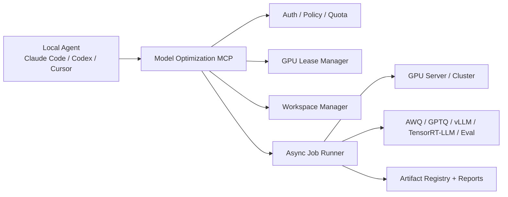

<p align="center">
  
</p>

<h1 align="center">Model Optimization MCP</h1>

<p align="center">
  <b>A governed GPU lab for Claude Code, Codex, Cursor, and other local coding agents.</b>
</p>

<p align="center">
  <a href="README.zh-CN.md">中文 README</a>
  ·
  <a href="docs/architecture.md">Architecture</a>
  ·
  <a href="docs/tool-reference.md">Tool Reference</a>
  ·
  <a href="docs/agent-skill-pack.md">Agent Skill Pack</a>
</p>

<p align="center">
  
  
  
  
</p>

## Why This Exists

Model onboarding for inference optimization is still too manual: engineers copy models to a GPU box, inspect configs, fight CUDA/runtime drift, run quantization scripts, evaluate accuracy, benchmark serving performance, collect logs, and write reports. It gets worse when many engineers share the same GPU server.

This repository turns that GPU server into a controlled MCP server. Local agents do the planning and explanation; this server handles the safe execution boundary.



## What It Covers

- GPU resource governance: snapshots, leases, queue state, TTL renewal, release, usage summaries, orphan scans, managed service ports.
- Workspace governance: isolated project workspaces, safe file reads/writes, model/dataset staging, checksums, disk quotas, cleanup.
- Runtime governance: approved runtime environments and whitelisted task templates instead of arbitrary shell.
- Model onboarding: guided runs with next-action hints for agents that are not custom-built by your team.
- Quantization workflows: recipe recommendation, AWQ/GPTQ/INT8/FP8-style recipe metadata, quantization job submission.
- Evaluation and benchmark: baseline eval, quantized eval, latency/throughput benchmark, temporary inference services, comparison, profiling, compile/export hooks.
- Artifact lineage: every candidate records model, recipe, job, run, runtime, and result metadata.
- GitHub-ready developer experience: bilingual docs, CI, Dockerfile, examples, skill prompt, security model, and tests.

## Current Runtime Mode

The project ships with a **simulation runner** by default. That is intentional:

- You can clone it and run tests without a GPU.
- Agent workflows, resource leases, job states, logs, metrics, artifacts, and reports all work locally.
- Production teams can replace the runner adapters with Docker, Slurm, Kubernetes, Ray, or internal execution backends.

## Quick Start

```bash
git clone https://github.com/your-org/model-optimization-mcp.git
cd model-optimization-mcp
python -m venv .venv
. .venv/bin/activate  # Windows: .venv\Scripts\activate
pip install -e ".[dev]"
model-optimization-mcp doctor
```

Run as a local stdio MCP server:

```bash
model-optimization-mcp stdio
```

Run as a Streamable HTTP MCP server:

```bash
MOMCP_HOME=/srv/model-optimization-mcp \
model-optimization-mcp http --host 0.0.0.0 --port 8000
```

## Minimal Agent Flow

An external local agent should follow this pattern:

```text
1. health_check
2. start_model_onboarding
3. run_onboarding_stage(run_id, "inspect_model")
4. estimate_resource_need
5. request_resource_lease
6. run_onboarding_stage(..., lease_id=...)
7. get_job_status / get_job_logs
8. get_next_recommended_action
9. generate_onboarding_report
```

The key rule: **GPU stages require a server-issued `lease_id`**. Agents do not choose GPUs by parsing `nvidia-smi`; the server does.

## Example Tool Call

```json
{
  "tool": "start_model_onboarding",
  "arguments": {
    "project_id": "team-a",
    "user_id": "alice",
    "model_uri": "s3://models/qwen2.5-7b-instruct",
    "target_hardware": "H100",
    "optimization_goal": {
      "quantization": ["int4", "int8"],
      "max_accuracy_drop": 0.01,
      "min_speedup": 2.0
    },
    "eval_dataset_id": "eval-internal-chat-v2"
  }
}
```

The server returns a `run_id`, `workspace_id`, and a `next_action` that local agents can follow even if they are not specialized model-optimization agents.

## Repository Map

```text
src/model_optimization_mcp/
  server.py                 FastMCP tools, resources, prompts
  app.py                    service wiring
  config.py                 environment settings
  store.py                  JSON metadata store
  services/
    resource_manager.py     GPU leases, queue, usage, snapshots
    workspace_manager.py    safe workspaces and staging
    job_manager.py          async job runner and task templates
    onboarding.py           guided model onboarding workflow
    artifacts.py            artifact registry and reports
    catalog.py              default envs, recipes, datasets, templates
docs/
  architecture.md
  tool-reference.md
  deployment.md
  security.md
  agent-skill-pack.md
skills/model-onboarding/SKILL.md
examples/
```

## Production Adapter Roadmap

- Replace the simulation runner with Docker, Slurm, Kubernetes, or Ray.
- Add SSO/OIDC/mTLS at the gateway layer.
- Move JSON state to Postgres and job events to Redis or Kafka.
- Integrate artifact storage with S3, MinIO, Ceph, MLflow, or an internal model registry.
- Register real quantization templates for AWQ, GPTQ, SmoothQuant, FP8, TensorRT-LLM, vLLM, and internal compilers.
- Add policy hooks for regulated datasets, model export controls, and production promotion approvals.

## References

This project uses the official MCP Python SDK / FastMCP patterns for tools, resources, prompts, and Streamable HTTP transport:

- [modelcontextprotocol/python-sdk](https://github.com/modelcontextprotocol/python-sdk)
- [MCP Python SDK server docs](https://modelcontextprotocol.github.io/python-sdk/server/)

## License

MIT. See [LICENSE](LICENSE).
