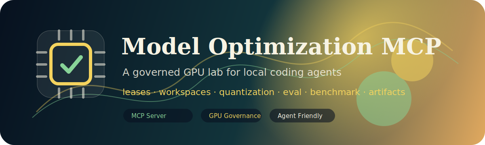
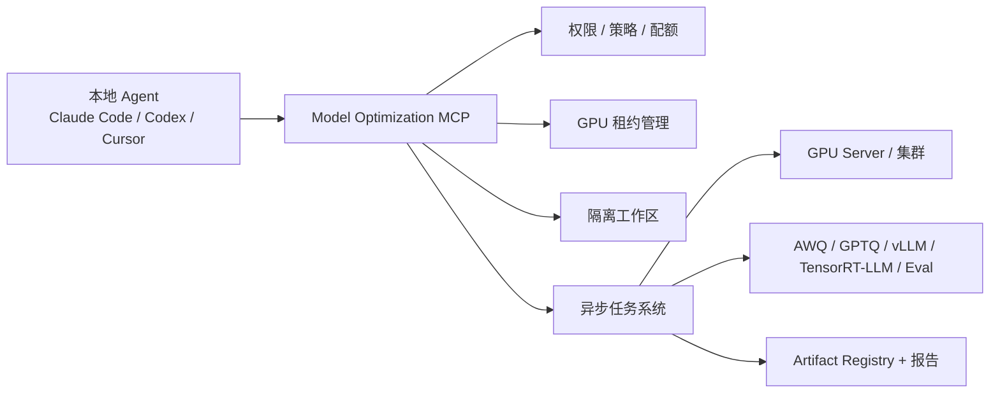

<p align="center">
  
</p>

<h1 align="center">Model Optimization MCP</h1>

<p align="center">
  <b>给 Claude Code、Codex、Cursor 等本地 Agent 使用的企业级 GPU 推理优化操作网关。</b>
</p>

<p align="center">
  <a href="README.md">English README</a>
  ·
  <a href="docs/architecture.md">架构</a>
  ·
  <a href="docs/tool-reference.md">工具清单</a>
  ·
  <a href="docs/agent-skill-pack.md">Agent Skill</a>
</p>

<p align="center">
  
  
  
  
</p>

## 项目定位

很多企业里的模型推理优化流程仍然高度依赖工程师经验：拷模型、检查 tokenizer/config、切 CUDA 环境、跑量化脚本、做精度评估、跑 benchmark、看日志、整理报告。多人共用同一台 GPU server 时，还会出现抢卡、抢端口、磁盘爆掉、任务归属不清等问题。

这个项目把 GPU server 包装成一个 **受控 MCP Server**。本地 Agent 负责理解需求、规划流程、解释结果；MCP Server 负责安全执行、资源治理、任务审计和产物沉淀。



## 覆盖能力

- GPU 资源治理：资源快照、租约申请、排队、TTL 续租、释放、用户/项目用量、孤儿任务扫描、服务端口管理。
- 工作区治理：项目隔离目录、安全文件读写、模型/数据 staging、checksum、磁盘配额、清理。
- 环境治理：白名单 runtime env、白名单 task template，不开放任意 shell。
- 模型 onboarding：面向普通本地 Agent 的 guided run 和 next-action 提示。
- 量化流程：recipe 推荐、AWQ/GPTQ/INT8/FP8 风格 recipe、量化任务提交。
- 评估与性能：baseline eval、量化后 eval、吞吐/延迟 benchmark、临时推理服务、结果对比、profiling、compile/export hook。
- 产物 lineage：每个 candidate 记录 model、recipe、job、run、runtime 和指标。
- GitHub 展示：中英文 README、架构文档、工具清单、Skill 示例、CI、Docker、Issue/PR 模板。

## 当前运行模式

仓库默认使用 **simulation runner**。这是刻意设计的：

- 没有 GPU 的开发机也可以跑通测试和 demo。
- resource lease、job 状态机、logs、metrics、artifacts、report 都能本地验证。
- 生产环境可以把 runner 替换成 Docker、Slurm、Kubernetes、Ray 或企业内部执行系统。

## 快速开始

```bash
git clone https://github.com/your-org/model-optimization-mcp.git
cd model-optimization-mcp
python -m venv .venv
. .venv/bin/activate  # Windows: .venv\Scripts\activate
pip install -e ".[dev]"
model-optimization-mcp doctor
```

以本地 stdio MCP server 运行：

```bash
model-optimization-mcp stdio
```

以 Streamable HTTP MCP server 运行：

```bash
MOMCP_HOME=/srv/model-optimization-mcp \
model-optimization-mcp http --host 0.0.0.0 --port 8000
```

## Agent 标准调用流程

外部本地 Agent 建议按这个流程走：

```text
1. health_check
2. start_model_onboarding
3. run_onboarding_stage(run_id, "inspect_model")
4. estimate_resource_need
5. request_resource_lease
6. run_onboarding_stage(..., lease_id=...)
7. get_job_status / get_job_logs
8. get_next_recommended_action
9. generate_onboarding_report
```

核心规则：**所有 GPU 阶段都必须先拿到服务端签发的 `lease_id`**。Agent 不应该自己解析 `nvidia-smi` 然后决定用哪张卡，这个裁决应该由 server 完成。

## 示例 Tool Call

```json
{
  "tool": "start_model_onboarding",
  "arguments": {
    "project_id": "team-a",
    "user_id": "alice",
    "model_uri": "s3://models/qwen2.5-7b-instruct",
    "target_hardware": "H100",
    "optimization_goal": {
      "quantization": ["int4", "int8"],
      "max_accuracy_drop": 0.01,
      "min_speedup": 2.0
    },
    "eval_dataset_id": "eval-internal-chat-v2"
  }
}
```

返回结果会包含 `run_id`、`workspace_id` 和 `next_action`。即使本地 Agent 不是你们自研的专用 Agent，也能根据服务端提示继续执行。

## 目录结构

```text
src/model_optimization_mcp/
  server.py                 FastMCP tools/resources/prompts
  app.py                    服务装配
  config.py                 环境配置
  store.py                  JSON metadata store
  services/
    resource_manager.py     GPU lease、queue、usage、snapshot
    workspace_manager.py    安全 workspace 和 staging
    job_manager.py          异步 job runner 和 task template
    onboarding.py           guided model onboarding workflow
    artifacts.py            artifact registry 和 report
    catalog.py              默认 env、recipe、dataset、template
docs/
  architecture.md
  tool-reference.md
  deployment.md
  security.md
  agent-skill-pack.md
skills/model-onboarding/SKILL.md
examples/
```

## 生产化路线

- 把 simulation runner 替换成 Docker、Slurm、Kubernetes 或 Ray。
- 在 MCP Gateway 层接入 SSO/OIDC/mTLS。
- 把 JSON state 换成 Postgres，把 job event 接到 Redis/Kafka。
- 把 artifact 接到 S3、MinIO、Ceph、MLflow 或内部模型仓库。
- 注册真实 AWQ、GPTQ、SmoothQuant、FP8、TensorRT-LLM、vLLM、自研编译器任务模板。
- 增加数据权限、模型导出控制、生产发布审批等 policy hook。

## 参考

本项目基于官方 MCP Python SDK / FastMCP 的 tools、resources、prompts 和 Streamable HTTP 设计：

- [modelcontextprotocol/python-sdk](https://github.com/modelcontextprotocol/python-sdk)
- [MCP Python SDK server docs](https://modelcontextprotocol.github.io/python-sdk/server/)

## License

MIT. See [LICENSE](LICENSE).
