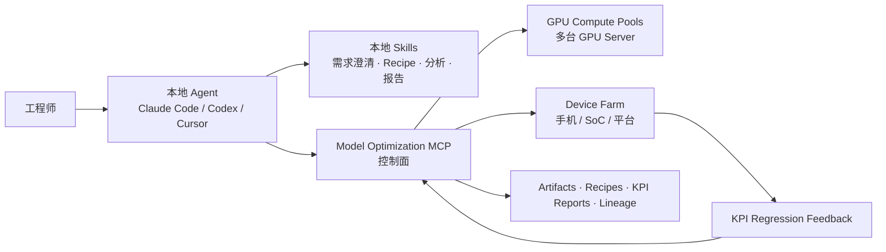
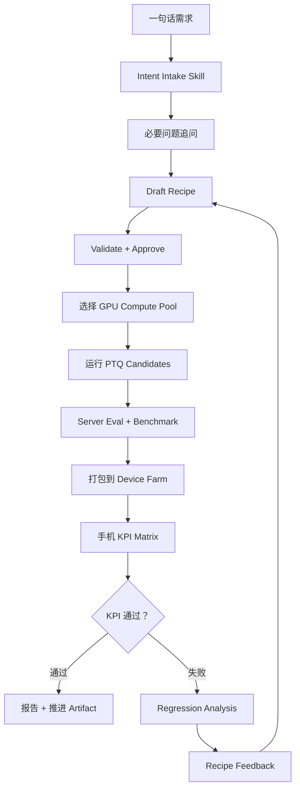

<p align="center">
  
</p>

<h1 align="center">Model Optimization MCP</h1>

<p align="center">
  <b>面向模型量化、GPU 执行、Device Farm KPI 验证和 Recipe 回流的 Hybrid Skill + MCP 控制面。</b>
</p>

<p align="center">
  <a href="README.md">English README</a>
  ·
  <a href="docs/enterprise-blueprint.md">企业蓝图</a>
  ·
  <a href="docs/architecture.md">架构</a>
  ·
  <a href="docs/tool-reference.md">工具清单</a>
  ·
  <a href="docs/agent-skill-pack.md">Agent Skills</a>
</p>

<p align="center">
  
  
  
  
</p>

## 项目定位

这个项目不是简单的“GPU server MCP 工具集合”，而是一个更接近真实企业形态的参考实现：工程师可以对 Claude Code、Codex、Cursor 这类本地 Agent 说：

```text
“用 PTQ 量化 Qwen3.6 模型，目标是安卓手机端侧。”
```

本地 Agent 不需要是你们自研的专用 Agent。它可以通过本地 skill 完成需求理解、问题追问、recipe 草拟、失败分析和报告表达；同时调用 MCP Server 完成共享状态、资源治理、远端执行、device farm 测试、KPI 报告、审计和闭环回流。



## 为什么是 Hybrid Skill + MCP

不是所有步骤都应该做成 MCP tool。

适合本地 skill 的事情：

- 把模糊的人类需求转成结构化需求；
- 形成必要追问；
- 草拟和解释 recipe；
- 分析 badcase、日志和 KPI 失败；
- 生成面向工程师/评审的说明。

适合 MCP 的事情：

- 维护共享状态；
- GPU 资源租约、排队和配额；
- 多台 GPU server 的 compute pool 调度；
- artifact、recipe、job、KPI 的 lineage；
- device farm 测试提交；
- KPI 报告、反馈回流和审批审计。

所以这个仓库显式支持 `local_skill`、`mcp_tool`、`human_approval`、`hybrid`、`external_system` 多种执行类型。

## 端到端闭环



## 覆盖能力

- 需求 intake：把简短需求转成结构化 session 和必要问题。
- Recipe 生命周期：draft、validate、approve、revise、list。
- Hybrid workflow：每一步标明由本地 skill、MCP tool、人工审批还是外部系统执行。
- 控制面：compute pool、GPU worker node、heartbeat、capacity snapshot、pool selection、execution plan。
- 计算执行：资源快照、GPU lease、异步 job、workspace、量化、eval、benchmark、profiling、compile/export。
- Device farm：设备池、设备矩阵、端侧 KPI 测试、KPI 报告。
- 反馈闭环：分析失败 KPI，生成 recipe feedback，并创建新 recipe revision。
- GitHub 展示：中英文 README、企业蓝图、架构、安全、部署、工具文档、CI、Docker、skill pack。

## 快速开始

```bash
git clone https://github.com/Masterzhuior/model-optimization-mcp.git
cd model-optimization-mcp
python -m venv .venv
. .venv/bin/activate  # Windows: .venv\Scripts\activate
pip install -e ".[dev]"
model-optimization-mcp doctor
```

以 stdio MCP 运行：

```bash
model-optimization-mcp stdio
```

以 Streamable HTTP MCP 运行：

```bash
MOMCP_HOME=/srv/model-optimization-mcp \
model-optimization-mcp http --host 0.0.0.0 --port 8000
```

## 更真实的 Agent 调用链

```text
1. list_agent_skills
2. start_quantization_intake
3. answer_intake_questions
4. synthesize_quantization_recipe
5. validate_quantization_recipe
6. generate_hybrid_workflow_plan
7. approve_quantization_recipe
8. select_compute_pool
9. create_execution_plan_from_recipe
10. request_resource_lease
11. run_quantization / run_quantized_eval / run_benchmark
12. create_device_test_matrix
13. submit_device_farm_test
14. generate_kpi_report
15. analyze_kpi_regression
16. create_recipe_feedback
17. create_recipe_revision_from_feedback
```

核心原则：本地 skill 负责智能分析和表达，MCP 负责共享事实、资源准入、远端执行和可审计 lineage。

## 示例：一句话需求到 Recipe

```json
{
  "tool": "start_quantization_intake",
  "arguments": {
    "project_id": "team-mobile",
    "user_id": "alice",
    "utterance": "用 PTQ 量化 Qwen3.6 模型，目标是安卓手机端侧"
  }
}
```

服务端会返回必要问题，例如模型 URI、校准集、评估集、device matrix、KPI 阈值。回答后可以生成 recipe，其中包括：

- 模型来源；
- PTQ 候选方法；
- 校准策略；
- 评估标准；
- compute pool selector；
- device farm matrix；
- KPI acceptance gates；
- fallback 和 rollback 计划。

## 目录结构

```text
src/model_optimization_mcp/
  server.py                  FastMCP tools/resources/prompts
  app.py                     服务装配
  store.py                   本地/demo JSON metadata store
  services/
    intent_planner.py        intake、问题追问、recipe 合成和 revision
    skill_orchestrator.py    Hybrid Skill/MCP workflow plan
    control_plane.py         compute pool、GPU node、capacity、execution plan
    device_farm.py           device matrix、KPI run、regression feedback
    resource_manager.py      lease、queue、GPU snapshot、usage
    workspace_manager.py     安全 workspace 和 staging
    job_manager.py           异步 job runner 和模拟 task template
    onboarding.py            兼容早期 guided onboarding helper
    artifacts.py             artifact registry 和 report
docs/
  enterprise-blueprint.md
  architecture.md
  tool-reference.md
  agent-skill-pack.md
skills/
  model-onboarding/
  intent-intake/
  recipe-authoring/
  device-farm-evaluation/
  kpi-regression-analysis/
```

## 当前运行模式

仓库默认使用 simulation runner，因此没有 H100 或真实 device farm 也能跑测试。生产落地时，应把 adapter 替换成 Docker、Slurm、Kubernetes、Ray、内部 GPU 调度平台和真实设备农场 API，同时保持 MCP 契约稳定。

## 验证

```bash
py -3.12 -m pytest
py -3.12 -m ruff check .
python -m unittest discover -s tests
model-optimization-mcp doctor
```

## 参考

- [modelcontextprotocol/python-sdk](https://github.com/modelcontextprotocol/python-sdk)
- [MCP Python SDK server docs](https://modelcontextprotocol.github.io/python-sdk/server/)

## License

MIT. See [LICENSE](LICENSE).

