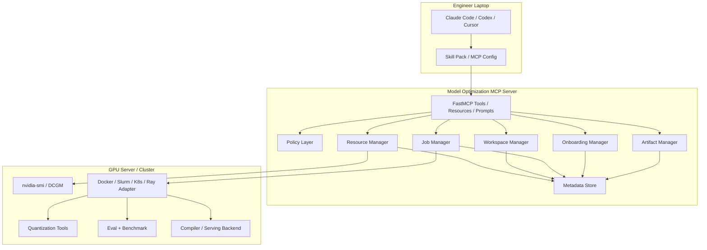

# Architecture

Model Optimization MCP is designed as a governed execution boundary between local coding agents and shared GPU servers.

## Design Goals

- External-agent friendly: Claude Code, Codex, Cursor, or an internal agent can use the same tools.
- Safe by default: no arbitrary shell, no arbitrary filesystem, no direct GPU selection by agents.
- Multi-user ready: every GPU job is tied to project, user, lease, workspace, and job metadata.
- Async-first: long-running quantization, evaluation, benchmark, compile, and profile jobs return `job_id`.
- Reproducible: artifacts preserve lineage across model, dataset, recipe, runtime, job, and run.

## Component Diagram



## Core Concepts

### Lease

A lease is a server-issued resource token. GPU jobs must include `lease_id`. The lease records:

- project and user,
- purpose,
- GPU UUIDs,
- TTL,
- CPU/RAM/disk requirements,
- scheduling policy.

### Workspace

A workspace is an isolated filesystem root managed by the server:

```text
workspaces/{project_id}/{run_id}/
  model/
  dataset/
  configs/
  logs/
  outputs/
  reports/
```

Tools can only read/write inside managed workspaces. This prevents local agents from wandering through arbitrary server paths.

### Job

A job is an asynchronous execution of a whitelisted task template. The default runner is simulated, but the shape mirrors production:

```text
created -> admitted -> resource_allocated -> preparing_workspace
-> pulling_image -> running -> collecting_metrics
-> uploading_artifacts -> succeeded
```

### Artifact

Artifacts include quantized models, eval results, benchmark results, profiler traces, compiled models, serving bundles, and reports. Each artifact records lineage.

## Production Adapter Points

The repository is intentionally modular:

- Replace `JobManager._execute_job` with Docker, Slurm, Kubernetes, Ray, or an internal runner.
- Replace `JsonStateStore` with Postgres or another metadata service.
- Replace staging markers in `WorkspaceManager` with S3/NFS/HF mirror adapters.
- Add policy checks before `request_resource_lease`, `stage_dataset`, `export_model`, and `promote_artifact`.
- Add real task templates that invoke approved internal scripts.

## Why Not Expose Shell?

An external local agent is not a security boundary. Even well-intentioned agents can produce unsafe commands, access unauthorized paths, or disrupt other users. This server exposes structured operations instead:

```text
run_quantization(model_id, recipe_id, lease_id, calibration_artifact_id)
```

not:

```text
ssh gpu-box "python quantize.py ..."
```

The server decides what is allowed, how it is scheduled, where outputs go, and how results are recorded.

