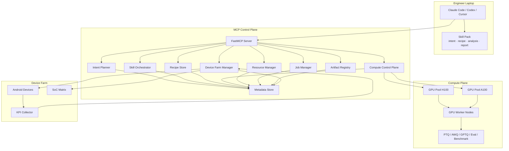

# Architecture

Model Optimization MCP is now modeled as a hybrid local-skill plus server-side MCP control plane.

## System View



## Main Services

| Service | Responsibility |
| --- | --- |
| `IntentPlanner` | Extract intent, ask required questions, synthesize and revise recipes. |
| `SkillOrchestrator` | Generate hybrid plans where steps can be skills, MCP tools, approvals, or external systems. |
| `ControlPlane` | Manage compute pools, GPU worker nodes, capacity snapshots, pool selection, execution plans. |
| `ResourceManager` | Manage leases, queues, local GPU snapshots, usage, orphan scans. |
| `JobManager` | Run approved async task templates. Simulation by default, replaceable in production. |
| `DeviceFarm` | Build device matrices, submit device tests, generate KPI reports, analyze regressions. |
| `ArtifactManager` | Track artifacts, reports, stages, and lineage. |

## Data Model

Core collections:

```text
intake_sessions
recipe_specs
workflow_plans
agent_skills
compute_pools
compute_nodes
leases
jobs
workspaces
artifacts
device_pools
devices
device_test_runs
kpi_reports
recipe_feedback
```

## Recipe-First Execution

The platform should not run quantization directly from a vague prompt. It should first create a recipe:

```text
utterance -> intake session -> questions -> recipe draft -> validation -> approval -> execution plan
```

This makes experiments reproducible and reviewable.

## Multi-GPU-Server Model

The control plane models multiple GPU servers as `compute_nodes` under `compute_pools`.

Example:

```text
gpu-lab-h100
  sim-h100-01: H100 x2
  sim-h100-02: H100 x8

gpu-lab-a100
  sim-a100-01: A100 x2
```

Pool selection can consider:

- required capability,
- region,
- GPU type,
- GPU memory,
- queue depth,
- runtime environment,
- project quota,
- priority.

The current repo includes simulation logic. Production should replace it with a real scheduler adapter.

## Device-Farm Feedback

For mobile or edge deployment, server-side benchmark is not enough. The flow is:

```text
quantized artifact
  -> package
  -> device matrix
  -> KPI run
  -> KPI report
  -> regression analysis
  -> recipe feedback
  -> recipe revision
```

The recipe revision can change calibration samples, fallback method, mixed precision strategy, sensitive-layer exclusion, backend selection, or device-specific packaging.

## Adapter Points

Replace these for production:

- `JsonStateStore` -> Postgres / internal metadata service.
- `JobManager` simulation -> Docker / Slurm / K8s / Ray / internal GPU job API.
- `WorkspaceManager` reference staging -> S3 / NFS / model registry / dataset registry.
- `DeviceFarm` simulation -> real phone farm API.
- Inline policy checks -> SSO/OIDC, approval service, quota service.

The public MCP tool contracts can stay stable while adapters evolve.

