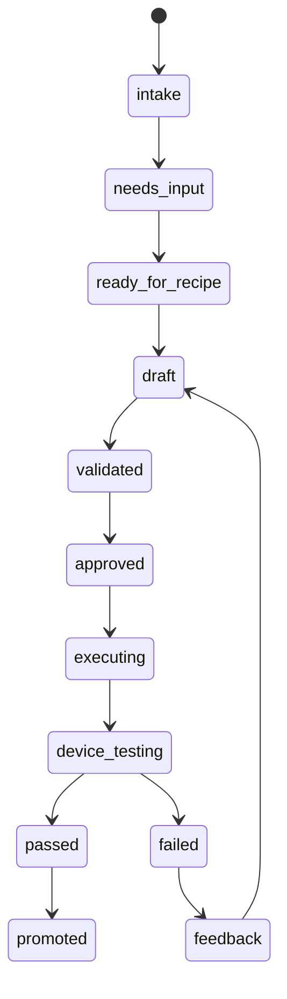

# Enterprise Blueprint

This document describes the target architecture for a future-facing model optimization platform where engineers use generic local agents, not a custom in-house agent.

## Product Shape

```text
Engineer laptop
  Claude Code / Codex / Cursor
  Local skill pack
        |
        | MCP
        v
MCP Gateway / Control Plane
  identity, policy, quotas, recipes, jobs, artifacts, lineage
        |
        +--> GPU compute pools
        |      many GPU servers / Slurm / K8s / Ray / internal runner
        |
        +--> Device farm
               Android/iOS devices, SoC matrix, KPI collection
```

## The Important Boundary

The local agent is not the platform. The local agent is an operator.

Skills can help the local agent reason, ask questions, write summaries, and choose the next workflow step. The MCP server owns the shared facts:

- recipe state,
- user/project identity,
- GPU leases,
- compute-pool selection,
- job state,
- artifact lineage,
- device test reports,
- KPI feedback,
- approvals.

This lets different agents use the same enterprise workflow.

## Why Skill Steps Exist

Some steps are not good MCP tools:

- "Ask the engineer the right three questions."
- "Explain why INT4 AWQ is risky for this model."
- "Summarize bad cases in plain language."
- "Draft a review-ready report."
- "Compare two recipe revisions and explain the tradeoff."

Those should be skills. MCP tools persist the resulting state and execute controlled operations.

## Recipe Lifecycle



### Recipe Contents

A production recipe should contain:

- model source and task type,
- quantization stage and candidates,
- calibration dataset and sampling policy,
- evaluation dataset and metrics,
- execution runtime and compute-pool selector,
- device-farm matrix,
- KPI acceptance gates,
- rollback and fallback strategy,
- approval and lineage metadata.

## Control Plane vs Compute Plane

### Control Plane

The MCP server models the control plane:

- stores recipes,
- validates workflows,
- selects compute pools,
- grants leases,
- tracks jobs,
- owns artifacts and reports,
- records device-farm KPI feedback.

### Compute Plane

The compute plane should be replaceable:

- single GPU server,
- many GPU servers,
- Slurm,
- Kubernetes,
- Ray,
- internal platform.

Workers should not expose arbitrary shell access. They should execute approved task templates.

## Device Farm Loop

Model optimization is not finished when a quantized artifact passes server-side eval. For mobile or edge deployment, the artifact needs real-device validation:

```text
artifact -> package -> device matrix -> KPI run -> report -> regression analysis -> recipe revision
```

KPI examples:

- accuracy delta,
- p50/p95 latency,
- memory peak,
- power,
- thermal,
- crash rate,
- load time,
- operator fallback count.

## Workflow Executor Types

| Executor | Meaning |
| --- | --- |
| `local_skill` | Local agent skill handles reasoning, writing, or local artifact preparation. |
| `mcp_tool` | MCP tool handles shared state or controlled remote execution. |
| `human_approval` | A human must approve budget, data access, promotion, or risk. |
| `hybrid` | Local skill analyzes while MCP stores state or executes a controlled action. |
| `external_system` | Approval, ticketing, model registry, or device-farm service outside MCP. |

## Production Hardening

Before production, add:

- SSO/OIDC identity propagation,
- project-level authorization,
- quota policy,
- approval workflow integration,
- Postgres metadata store,
- Redis/Kafka job events,
- object storage for artifacts,
- real GPU runner adapters,
- real device-farm adapters,
- Prometheus metrics,
- audit log retention.

