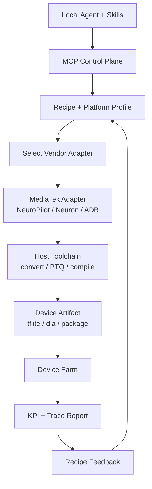

# MediaTek NeuroPilot Comparable Design Research

Date: 2026-05-28

This document studies public MediaTek materials around NeuroPilot, Genio, Dimensity, Model Zoo, and device-side AI deployment. The goal is not to claim MediaTek has an MCP/agent product, but to extract engineering patterns that are relevant to our Hybrid Skill + MCP model optimization platform.

## Executive Summary

MediaTek's public design is highly relevant to our direction. The closest parallels are:

- a host-side preparation toolchain that converts, quantizes, compiles, profiles, and evaluates models;
- a device-side execution model that distinguishes framework-based online inference from compiled offline NPU runtime;
- a platform catalog that records OS, framework, NPU, SDK, and accelerator support by SoC family;
- a model zoo and benchmark system for cross-platform capability validation;
- explicit handling for unsupported operators, hardware constraints, CPU fallback, and accuracy deltas;
- a mobile/edge ecosystem where real-device validation matters as much as server-side model conversion.

The strongest product lesson: our platform should treat "recipe" as a platform-specific deployment contract, not just a quantization config. For MediaTek-style device targets, a recipe must include SoC/NP/MDLA version, online/offline inference path, converter/compiler versions, supported op assumptions, device test matrix, KPI gates, and fallback strategy.

## Sources Reviewed

Primary sources:

- [MediaTek Artificial Intelligence](https://www.mediatek.com/technology/artificial-intelligence)
- [MediaTek NeuroPilot portal](https://neuropilot.mediatek.io/)
- [NeuroPilot public getting started](https://neuropilot-developer.mediatek.com/resources/public/latest/en/docs/readme)
- [MediaTek Genio platform](https://www.mediatek.com/products/iot/genio-iot)
- [Genio IoT AI Hub Model Zoo](https://mediatek.gitlab.io/genio/doc/iot-aihub/master/ai_hub/model_zoo/overview.html)
- [Genio AI software architecture](https://mediatek.gitlab.io/genio/doc/iot-aihub/master/ai_hub/software_architecture.html)
- [Genio AI development resources](https://mediatek.gitlab.io/genio/doc/iot-aihub/master/ai_hub/related_resource.html)
- [Genio performance benchmarks](https://mediatek.gitlab.io/genio/doc/iot-aihub/master/ai_hub/benchmark.html)
- [Genio accuracy evaluation](https://mediatek.gitlab.io/genio/doc/iot-aihub/master/ai_hub/ai-workflow/accuracy_evaluation.html)
- [Unsupported OP/model handling](https://mediatek.gitlab.io/genio/doc/iot-aihub/master/ai_hub/ai-workflow/troubleshooting.html)
- [Neuron Compiler and Runtime](https://mediatek.gitlab.io/genio/doc/iot-aihub/master/ai_hub/ai-workflow/neuron-sdk.html)
- [NPU Profiler: Neuron Studio](https://mediatek.gitlab.io/genio/doc/iot-aihub/master/ai_hub/ai-workflow/neuron_studio.html)
- [Dimensity 9300](https://www.mediatek.com/dimensity-9300)
- [Dimensity Open Resource Architecture](https://i.mediatek.com/dimensityopenresource)
- [MediaTek + NVIDIA TAO integration](https://www.mediatek.com/press-room/mediatek-integrates-nvidia-tao-toolkit-with-neuropilot-sdk-for-accelerated-development-of-edge-ai-applications-in-iot)
- [MediaTek + Qwen3 on Dimensity](https://developer.mediatek.com/ai/681dc0083648cc23f27eae09.html)

## What MediaTek Appears To Be Optimizing For

### 1. Edge AI as the Product Boundary

MediaTek positions NeuroPilot around edge AI: local processing on device for latency, privacy, and power efficiency. The official AI page says NeuroPilot can target SoC processing units such as NPUs, GPUs, and CPUs, or let the SDK handle allocation. The NeuroPilot portal similarly frames it as an ecosystem of tools and APIs for efficient AI applications on MediaTek platforms.

Implication for us:

- Our platform should not stop at server-side quantization.
- The acceptance contract should include device-side privacy, latency, memory, power, and thermal behavior.
- A model artifact is not "done" until it passes target-device KPIs.

### 2. Host-Device Split

The Genio AI software architecture is explicit: host-side tools prepare and compile models, while devices either run framework-based models or compiled NPU artifacts. MediaTek describes:

- online inference: TFLite or ONNX Runtime loads deployable models and delegates to CPU/GPU/NPU backends;
- offline inference: a compiled `.dla` model runs through Neuron Runtime on the NPU without a full AI framework on device.

Implication for us:

- This maps cleanly to our control plane and device farm split.
- The MCP control plane should treat "host-side pipeline" and "device-side validation" as separate stages.
- Recipe schema should explicitly include `inference_path: online | offline`.

### 3. Toolchain as a Sequential Pipeline

For GenAI offline workflow, MediaTek's documentation lists a sequence: model quantization interface, post-training quantization to TFLite, compile to `.dla`, cross-compile inference executable, push to device, and run inference.

Implication for us:

- Our recipe should compile into a DAG, not a loose set of tool calls.
- A MediaTek-oriented adapter would expose steps such as:
  - `run_np_converter`
  - `run_post_training_quantize`
  - `run_neuron_compile`
  - `package_neuron_runtime_app`
  - `push_artifact_to_device`
  - `run_device_inference`
  - `collect_device_kpis`

### 4. Platform/SDK/Hardware Binding

The Genio AI development resources state that NeuroPilot version is tied to MDLA hardware generation and that supported operations/hardware restrictions are platform-specific. It also notes that tools must match the target hardware's NeuroPilot version.

Implication for us:

- Recipe validation must be platform-aware.
- `target_platform` is not enough; we need SoC, NP version, MDLA version, OS, runtime, framework, and compiler bundle.
- Device-farm inventory should carry these fields, not just "Android phone".

Recommended schema additions:

```json
{
  "target_platform": {
    "vendor": "mediatek",
    "product_line": "dimensity|genio",
    "soc": "dimensity-9400|genio-720",
    "os": "android|yocto|ubuntu",
    "np_version": "NP8",
    "mdla_version": "5.3",
    "runtime": "neuron-runtime|tflite|onnxruntime",
    "inference_path": "online|offline"
  }
}
```

### 5. Model Zoo and Benchmark as Capability Validation

The Genio Model Zoo provides ready-to-use models validated on Genio platforms. It is used to evaluate performance across CPU/GPU/NPU, compare frameworks/delegates, and reuse example flows. The docs are careful that the Model Zoo is for benchmarking and capability validation, not production accuracy replacement.

Implication for us:

- Our platform needs two benchmark layers:
  - reference/capability benchmark for platform sanity;
  - application/business benchmark for production acceptance.
- We should not let an agent treat Model Zoo-style results as production accuracy proof.

### 6. Accuracy Evaluation Across Conversion Stages

The Genio accuracy evaluation flow compares original PyTorch, converted TFLite, NeuroPilot-converted TFLite, and compiled DLA on device. This is exactly the kind of lineage our recipe system should preserve.

Implication for us:

- Accuracy should be tracked at every stage:
  - source model baseline,
  - converted model on host,
  - quantized model on host,
  - compiled artifact on host/device,
  - real-device runtime output.
- Regression analysis should identify where degradation entered the pipeline.

Recommended artifact lineage:

```text
source_model
  -> converted_model
  -> quantized_model
  -> compiled_device_artifact
  -> device_runtime_result
  -> kpi_report
  -> recipe_feedback
```

### 7. Unsupported Operator Handling

MediaTek documents three failure locations:

- converter limitations;
- compiler/hardware constraints;
- runtime fallback or execution conflicts.

The recommended actions include upgrading SDK/tool bundles, replacing unsupported operations, modifying the model to match hardware constraints, or enabling CPU fallback if acceptable.

Implication for us:

- `analyze_kpi_regression` should be split into:
  - `analyze_conversion_failure`
  - `analyze_compile_failure`
  - `analyze_runtime_fallback`
  - `analyze_device_kpi_regression`
- Recipe feedback should encode the failure phase.

Recommended feedback shape:

```json
{
  "failure_phase": "conversion|compile|runtime|kpi",
  "root_cause_type": "unsupported_op|hardware_constraint|cpu_fallback|accuracy_regression|latency_regression",
  "affected_ops": ["Where", "Sin", "Erf"],
  "affected_devices": ["dimensity-9400-devkit"],
  "recommended_recipe_strategy": "replace_ops|enable_cpu_fallback|mixed_precision|increase_calibration"
}
```

### 8. Profiling as a First-Class Feedback Source

Neuron Studio monitors NPU frequency, NPU loading, DRAM utilization, and workflow traces. It supports recording traces from ADB-connected devices and analyzing them in the tool or external tools such as Perfetto.

Implication for us:

- Device farm should collect profiler artifacts, not just final latency.
- KPI reports should link to trace artifacts.
- Regression feedback should be able to say "latency failed because NPU loading is low and CPU fallback occurred" rather than just "p95 too high".

### 9. Mobile LLM Deployment Is Already a Strategic Direction

MediaTek's Dimensity 9300 materials describe the APU 790 and NeuroPilot Generative AI platform with compression, mixed precision INT4 quantization, transformer acceleration, LoRA, and speculative decoding. MediaTek's 2026 Dimensity Developer Center article says MediaTek and Alibaba Qwen completed Qwen3 deployment on Dimensity 9400, and specifically mentions small Qwen3 variants being validated for mobile deployment.

Implication for us:

- The user's example "PTQ quantize Qwen3.x for mobile" is not hypothetical; it matches a public industry direction.
- Recipe intake should know that Qwen-family models may require:
  - context-length constraints,
  - tokenizer/chat-template validation,
  - attention/kernel compatibility,
  - KV/cache memory strategy,
  - mixed precision or INT4/INT8 strategy,
  - device-specific generation benchmark.

## Comparison With Our Hybrid Skill + MCP Design

| Area | MediaTek Pattern | Our Current Design | Recommended Adjustment |
| --- | --- | --- | --- |
| Intent intake | Not public as agent flow | `IntentPlanner` + local skills | Keep. Add platform-specific question packs. |
| Recipe | Implicit in toolchain commands and docs | `recipe_specs` | Expand recipe for SoC/NP/MDLA/runtime/compiler. |
| Control plane | Developer portals, SDK access, platform docs | `ControlPlane` | Add vendor/platform catalog and SDK bundle registry. |
| Compute plane | Host PC tools + device execution | `JobManager`, compute pools | Add MediaTek runner adapter interface. |
| Device farm | ADB-connected boards/devices in docs | `DeviceFarm` simulation | Add ADB/device-lab adapter and profiler artifacts. |
| Benchmark | Model Zoo + benchmark tables | KPI reports and benchmark jobs | Separate capability benchmark vs product acceptance. |
| Accuracy | Baseline/source/converted/DLA comparisons | eval artifacts | Add stage-by-stage accuracy lineage. |
| Unsupported ops | Converter/compiler/runtime taxonomy | generic regression analysis | Add phase-specific failure classifiers. |
| Profiling | Neuron Studio traces | profiler job simulation | Add trace artifacts and Perfetto/Neuron Studio metadata. |
| Access/policy | Public/Basic/Premium, NDA for advanced docs | policy docs, approvals | Model SDK access level and export restrictions. |

## Recommended New Concepts For This Repo

### 1. Platform Profile Registry

Add a first-class registry for target platforms:

```text
platform_profiles/
  mediatek-dimensity-9400
  mediatek-genio-720
  qualcomm-snapdragon-8gen3
  apple-a-series
```

Each profile should include:

- SoC;
- OS;
- accelerator list;
- SDK/toolchain version;
- runtime options;
- supported operators;
- known issues;
- profiler support;
- accepted packaging formats.

### 2. Vendor Adapter Contract

Add a vendor adapter abstraction:

```python
class DeviceVendorAdapter:
    def inspect_platform(self, device_id): ...
    def convert_model(self, recipe_id): ...
    def quantize_model(self, recipe_id): ...
    def compile_model(self, recipe_id): ...
    def deploy_artifact(self, artifact_id, device_id): ...
    def run_inference(self, artifact_id, device_id, benchmark_config): ...
    def collect_profile(self, test_run_id): ...
    def analyze_failure(self, failure_id): ...
```

For MediaTek, this adapter would map to NeuroPilot/Neuron tooling where available.

### 3. MediaTek Recipe Extension

Suggested recipe extension:

```json
{
  "vendor_extensions": {
    "mediatek": {
      "toolchain": "neuropilot",
      "np_version": "NP8",
      "mdla_version": "5.3",
      "converter": "np-converter",
      "compiler": "ncc-tflite",
      "runtime": "neuron-runtime",
      "inference_path": "offline",
      "output_format": "dla",
      "cpu_fallback_allowed": false,
      "profiler": "neuron-studio"
    }
  }
}
```

### 4. Question Pack For MediaTek Targets

When intake detects MediaTek/mobile target, ask:

- Which SoC or device family: Dimensity, Genio, or specific device?
- Which OS: Android, Yocto, Ubuntu?
- Is the target online inference or offline NPU-only inference?
- Is CPU fallback allowed?
- What is the maximum p95 latency and memory budget?
- Are advanced NeuroPilot/GAI toolkit features available under the team's access level?
- Does the model require generative AI toolkit support or standard analytical AI flow?
- Which device matrix must pass before promotion?

### 5. KPI Report Extension

KPI should include:

- model output correctness/accuracy;
- p50/p95/p99 latency;
- first-token and token/s for LLMs;
- memory peak;
- power and thermal;
- NPU loading;
- CPU fallback count;
- unsupported op count;
- profiler trace URI;
- device/SoC/OS/SDK identifiers.

## Architecture Update Proposal



## Key Takeaways

1. MediaTek validates our instinct that the system must be platform-aware and device-aware.
2. The recipe should be a deployment contract, not just a quantization config.
3. Device-farm KPI feedback is essential, especially for mobile/edge.
4. Unsupported-op and runtime-fallback analysis should be first-class.
5. Skill + MCP is still the right split: local skills reason and explain; MCP owns shared state, toolchain execution, device farm integration, and lineage.

## Suggested Next Implementation Tasks

1. Add `platform_profiles` collection to the store.
2. Add `vendor_adapters` collection with a `mediatek-neuropilot` sample adapter spec.
3. Extend `recipe_specs.spec.target_platform`.
4. Add `start_platform_intake` or platform-specific question packs.
5. Add `analyze_conversion_failure`, `analyze_compile_failure`, and `analyze_runtime_fallback` tools.
6. Extend `DeviceFarm` results with NPU loading, CPU fallback count, profiler trace URI, and SDK version.
7. Add docs for a MediaTek-style end-to-end flow:
   `source -> convert -> PTQ -> compile -> deploy -> device KPI -> feedback`.

